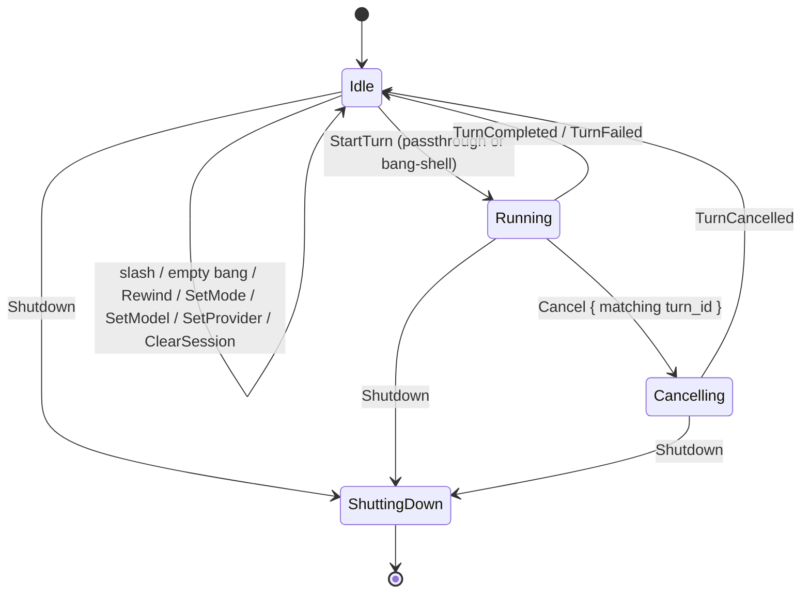
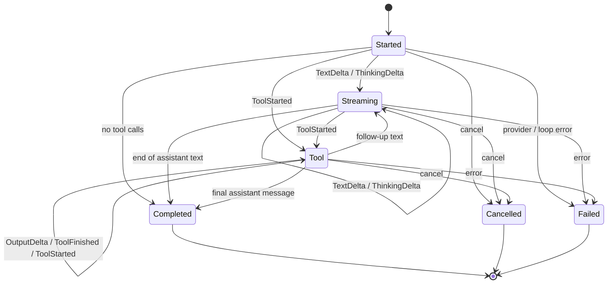
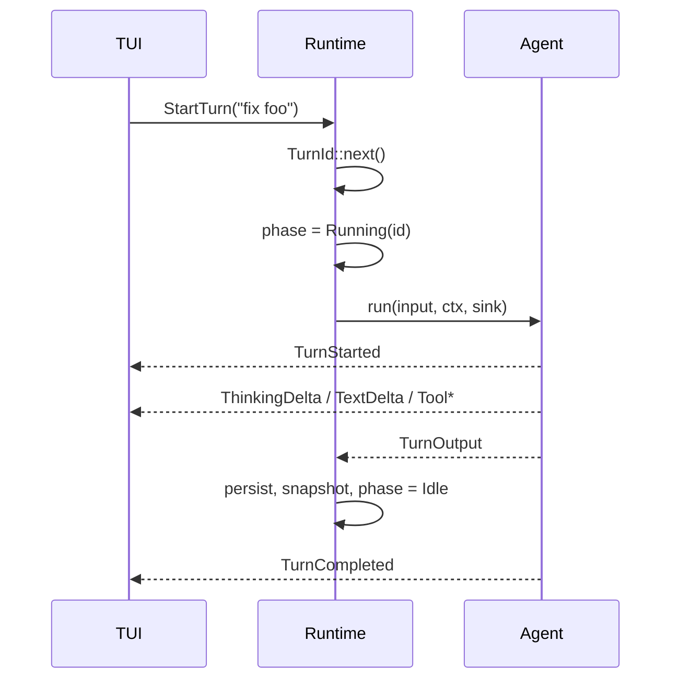
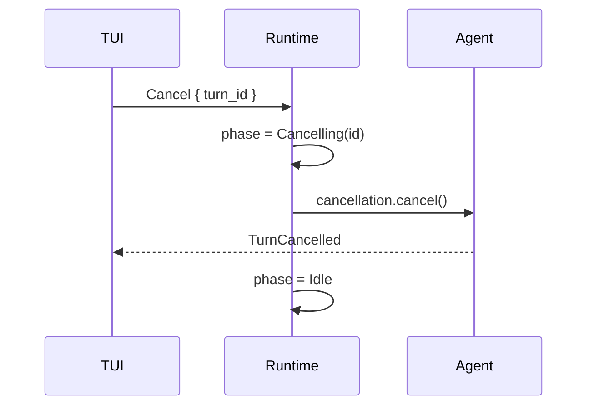
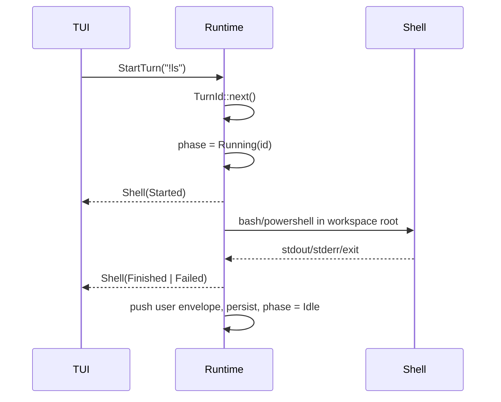

# Oven protocol

Oven splits four concepts:

```text
Command  ──→  Runtime  ──→  Event Stream
                         └─→  State

Message  ←──────────────→  History / Session
```

| Concept | Meaning |
| --- | --- |
| **Command** | A request to do something |
| **Message** | What is in the LLM conversation |
| **Event** | What happened while running |
| **State** | What the system is now |

Commands never contain events. Events never contain commands. Turn streaming is not the same as session history.

```text
                        ┌──────────────┐
                        │   oven-tui   │
                        └──────┬───────┘
                               │ AppCommand
                               ▼
                     ┌──────────────────┐
                     │   App Runtime    │
                     │                  │
                     │   AppState  ◄────┤ watch
                     │       ▲          │
                     │       │          │
                     │     Agent        │
                     └───────┼──────────┘
                             │ AgentEventEnvelope
             ┌───────────────┼──────────────┐
             ▼               ▼              ▼
         Lifecycle         Stream          Tool
```

## Crate ownership

| Crate | Owns |
| --- | --- |
| `oven-llm` | `Message`, `Usage`, provider I/O |
| `oven-agent` | `Agent`, turn execution, `AgentEvent`, `EventSink` |
| `oven-app` | `App`, `AppBuilder`, `AppCommand`, `AppEvent`, `AppState`, runtime actor, session, local shell |
| `oven-tui` | render events and state; send commands |

## App facade

`App` is the only public runtime handle. `AppHandle` is gone. `AppBuilder` loads config, skills, tools, and MCP, then `open()` / `open_session()` spawns the actor.

```text
AppBuilder ──open──► App ──AppCommand──► Runtime
                     │
                     ├── subscribe()    → AppEvent
                     └── watch_state()  → AppState
```

## IDs

```text
AppId
 └── AgentId
       └── TurnId          created by the app runtime
             └── ToolCallId  created by the agent
```

IDs start at 1. There is no `Default` sentinel of `0`.

A turn is an app-level user request. The runtime allocates `TurnId` and passes it into `Agent::run` via `TurnContext`.

---

# Commands

TUI / CLI → runtime:

```rust
pub enum AppCommand {
    StartTurn { input: String },
    Cancel { turn_id: TurnId },
    Rewind,
    ClearSession,
    SetMode { mode: AgentMode },
    SetModel { model: String, reasoning_effort: Option<ReasoningEffort> },
    SetProvider { provider: ProviderConfig },
    Shutdown,
```

Slash commands still arrive as `StartTurn { input: "/plan on" }`. The runtime parses them and either starts an agent turn or applies a state change.

A composer line whose trimmed body starts with `!` is a **local shell request**, not a slash command and not an LLM turn. The runtime strips the bang, runs the host shell (bash on Unix, PowerShell on Windows) in the workspace root, and commits one user message describing the command and its result.

Input received while a turn is running is queued and processed after the turn ends.

---

# Events

## Agent events

Emitted during one LLM turn. History and model stay on the committed `Message` / `AppState`. Todo updates are the exception: the agent emits `TodosChanged` and the runtime mirrors it into `StateChange::TodosChanged`.

```rust
pub struct AgentEventEnvelope {
    pub seq: u64,
    pub agent_id: AgentId,
    pub turn_id: TurnId,
    pub event: AgentEvent,
}

pub enum AgentEvent {
    Turn(TurnEvent),
    Stream(StreamEvent),
    Tool(ToolEvent),
    TodosChanged { todos: TodoList },
}
```

`seq` is the log position for that turn. It is not a timestamp.

```text
TurnEvent     Started | Completed { usage } | Cancelled | Failed { error }
StreamEvent   TextDelta { text } | ThinkingDelta { text }
ToolEvent     Started { call_id, name, view }
              OutputDelta { call_id, stream, text }
              Finished { call_id, result }
```

`ToolResult` is `Success`, `Failed { error, output }`, or `Cancelled` — not `ok: bool`.

Tool input is not on `ToolEvent::Started`. The UI uses `ToolView`. `view.diff` paints `+/-` lines as a file diff. Full arguments live on the committed `Message`.

Final assistant text is the concatenation of `TextDelta`s (or `TurnOutput` / history), not a duplicated `Done { text }`.

## App events

```rust
pub struct AppEvent {
    pub seq: u64,
    pub kind: AppEventKind,
}

pub enum AppEventKind {
    Agent(AgentEventEnvelope),
    StateChanged(StateEvent),
    Shell(ShellEvent),
    Notification { text: String },
    Error { message: String },
    Exited,
}

pub enum ShellEvent {
    Started { command: String },
    Finished { command: String, output: String, exit_code: i32 },
    Failed { command: String, error: String, output: String },
}
```

There is no `Idle` event. Turn completion is `TurnEvent::Completed | Cancelled | Failed`. App idleness is `AppState.phase`.

Subscribers get a lossless unbounded channel. `App::state()` / `watch_state()` is the current snapshot.

## Agent API

```rust
agent.run(input, TurnContext { turn_id, cancellation }, &mut sink)
    -> Result<TurnOutput, AgentError>
```

`EventSink::emit` is synchronous. Production uses `ChannelEventSink`; tests use `VecEventSink`.

```text
Event       = streaming / lifecycle
TurnOutput  = function return value
```

---

# State

```rust
pub struct AppState {
    pub phase: AppPhase,
    pub mode: AgentMode,
    pub model: String,
    pub reasoning_effort: Option<ReasoningEffort>,
    pub provider: ProviderConfig,
    pub configured_providers: Vec<String>,
    pub history: Vec<Message>,
    pub todos: TodoList,
    pub last_turn_usage: Usage,
    pub session: SessionState,
    pub models: Vec<(String, String)>,
}

pub enum AppPhase {
    Idle,
    Running { turn_id: TurnId },
    Cancelling { turn_id: TurnId },
    ShuttingDown,
}
```

`StateChange` tells the UI *what* moved; `watch` is *what is true now*:

```text
ModelChanged | ModeChanged | TodosChanged | HistoryChanged
SessionChanged | UsageChanged | ProviderChanged | ModelsChanged
```

`UsageChanged` carries `last_turn_usage` — tokens for the most recent agent turn, not a session total. `ProviderChanged` includes `configured_providers` (canonical slugs saved under `[providers.<slug>]`).

UI rule: consume state as truth, events as “something happened”.

| Old event | Now |
| --- | --- |
| `AgentEvent::Done { text, usage }` | `TurnCompleted` + `TextDelta*` |
| `AgentEvent::HistoryCleared` | `StateChange::HistoryChanged` |
| `AgentEvent::ModelChanged` | `StateChange::ModelChanged` |
| `AgentEvent::TodoUpdated` | `AgentEvent::TodosChanged` + `StateChange::TodosChanged` |
| `AppEvent::Idle` | `AppPhase::Idle` |
| `AppEvent::Rewound { messages, … }` | `HistoryChanged` + `UsageChanged` |
| `AppEvent::Notify` | `Notification` |
| `AppEvent::Exit` | `Exited` |

---

# App phase machine

Phase is runtime state. Turn events are facts about one turn. Do not mix them.



Idle slash commands do not enter `Running`. They emit `StateChanged` and/or `Notification` and stay `Idle`.

A bang-shell `StartTurn` enters `Running` like an agent turn (so Cancel and queuing work) but emits `AppEventKind::Shell` instead of `AgentEvent`. The agent is not called. On finish the runtime appends a `<local-shell>` user message and persists; it does not emit `HistoryChanged` on the live path.

`Cancel` while idle is a no-op. `Cancel { turn_id }` only applies if it matches the active turn.

---

# Turn event machine

Each turn: exactly one `Started`, exactly one terminal event.



Typical successful sequence:

```text
TurnStarted
  ThinkingDelta*
  ToolStarted → ToolOutputDelta* → ToolFinished
  TextDelta*
TurnCompleted
```

Then runtime sets `phase = Idle`. `TurnCompleted` is the fact; `Idle` is the phase.

---

# Flows

## Normal turn



## Cancel



## Slash (no turn)

```text
StartTurn("/model gpt-4o")
  → SetModel
  → StateChanged(ModelChanged)
  → Notification("model switched…")
  → phase stays Idle
```

`prompt()` waits for `TurnCompleted`/`Cancelled`/`Failed`, or `Shell` Finished/Failed, or for `Notification`/`Exited` when no turn started.

## Bang shell



The TUI shows the typed `!` line as a user row and the last 100 output lines as a result row. The committed user message is the parseable envelope so resume/rewind can rebuild the same rows. The agent does not auto-reply.

---

# Invariants

1. `Running(turn_id)` means exactly one active request: an agent turn **or** a bang-shell command.
2. Every `AgentEventEnvelope.turn_id` matches `phase.turn_id()` while the phase is `Running` or `Cancelling`. Agent envelopes are not emitted for bang-shell.
3. Each agent turn emits exactly one `Started` and exactly one of `Completed | Cancelled | Failed`. Each bang-shell request emits exactly one `Shell::Started` and exactly one of `Finished | Failed`.
4. `ToolFinished` is always preceded by `ToolStarted` for the same `ToolCallId`.

Runtime is a single actor:

```rust
struct Runtime {
    agent: Agent,
    state: AppState,
    session: Option<SessionStore>,
    config: AppConfig,
}

impl Runtime {
    async fn run(mut self, mut rx: Receiver<AppCommand>) { /* dispatch */ }
}
```

`runtime/mod.rs` owns select, command dispatch, and `start_turn` / `cancel_turn` / `persist_turn`. `builder.rs` owns construction.
