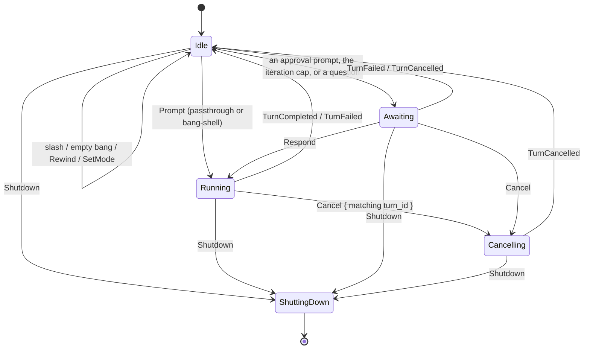
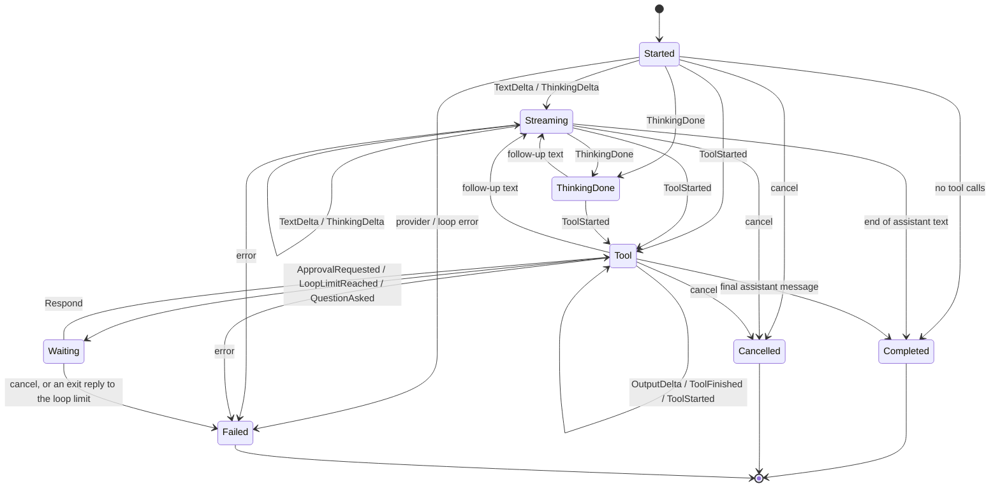
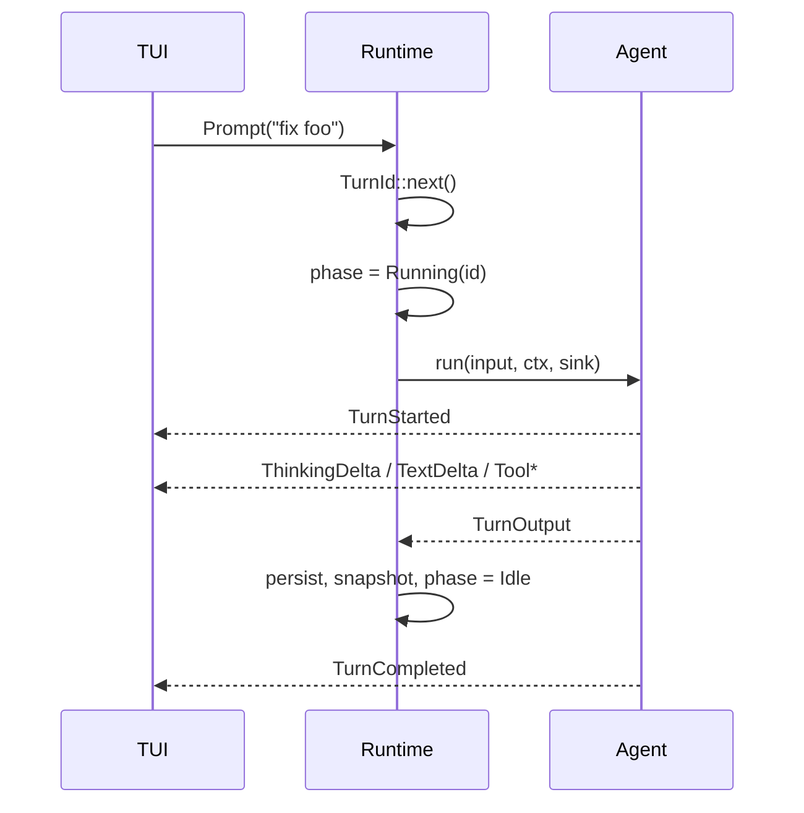
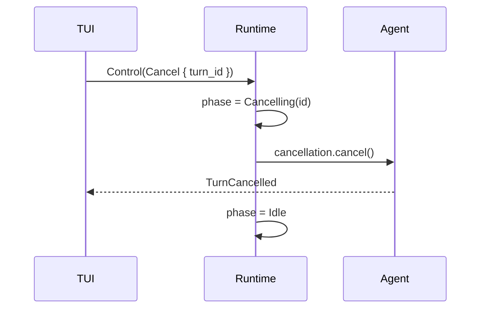
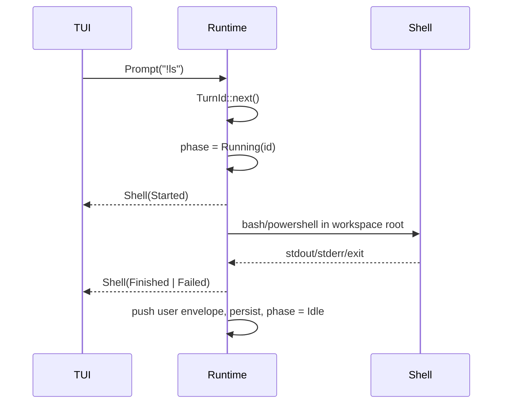

# Oven protocol

Oven splits four concepts:

```text
Command  ──→  Runtime  ──→  Event Stream
                         └─→  State

Message  ←──────────────→  History / Session
```

| Concept | Meaning |
| --- | --- |
| **Command** | A request to do something |
| **Message** | What is in the LLM conversation |
| **Event** | What happened while running |
| **State** | What the system is now |

Commands never contain events. Events never contain commands. Turn streaming is not the same as session history.

```text
                        ┌──────────────┐
                        │   oven-tui   │
                        └──────┬───────┘
                               │ AppCommand
                               ▼
                     ┌──────────────────┐
                     │   App Runtime    │
                     │                  │
                     │   AppState  ◄────┤ watch
                     │       ▲          │
                     │       │          │
                     │     Agent        │
                     └───────┼──────────┘
                             │ AgentEventEnvelope
             ┌───────────────┼──────────────┐
             ▼               ▼              ▼
         Lifecycle         Stream          Tool
```

## Crate ownership

| Crate | Owns |
| --- | --- |
| `oven-llm` | `Message`, `Usage`, provider I/O |
| `oven-agent` | `Agent`, `RouterHandle`, `TurnContext`, `RunPolicy`, turn execution, tool protocol, `AgentEvent`, `EventSink`, the `UserRequest` channel a turn asks the user on, history/todo domain models, the `SubagentSpawner` protocol and its `NodeInfo`/`NodeStatus` vocabulary, provider retry decoration |
| `oven-host` | Workspace filesystem access, path confinement, process execution, command-output decoding, directory walking, size-based log rotation |
| `oven-app` | `App`, `AppBuilder`, `AppCommand`, `ControlCommand`, `AppEvent`, `AppState`, app runtime actor, session persistence, local-shell orchestration, subagent supervision, tracing subscriber install |
| `oven-tui` | render events and state; send commands |

`oven-host` is infrastructure, not the app actor. The app runtime owns application state and command dispatch; `oven-host` only provides reusable capabilities with no dependency on Agent or App domain types.

TUI internals are documented in [`oven-tui.md`](./oven-tui.md), the app layer in
[`oven-app.md`](./oven-app.md), and subagents — with the seams they leave for
loop and graph engineering — in [`subagents.md`](./subagents.md).

The dependency direction is:

```text
oven-tui ──► oven-app ──► oven-agent ──► oven-llm
                   │          │
                   └──────────┴──► oven-host
```

`oven-host` may depend on operating-system and third-party implementation crates such as Tokio and `ignore`, but those types do not appear in its public API. Consumers use host-owned types such as `WalkEntry`, `PathError`, and `CommandError`. Pattern matching remains an Agent concern.

## Infrastructure boundary

`oven-host` isolates external side effects from Agent orchestration:

| Capability | Host API | Agent/App responsibility |
| --- | --- | --- |
| Workspace paths | `resolve_within` | Parse tool arguments and map errors to domain errors |
| File access | `write` | Choose paths and content; read files and map errors to domain errors |
| Process execution | `run_shell_command` | Choose command, timeout, cancellation, and event formatting |
| Output decoding | `decode_command_output` | Render decoded stdout/stderr and exit status |
| File discovery | `walk_dir` (files only), `walk_all` (+ directories), `WalkEntry` | Apply glob/grep semantics and result limits |
| Log files | `RotatingFile` | Install the tracing subscriber at process start (`oven-app::log`); emit spans from agent/app |

The host facade deliberately does not know about `AgentError`, `Tool`, `AgentEvent`, `AppEvent`, or `AppState`. This keeps the infrastructure reusable and prevents a dependency cycle.

`oven-agent` retains the `Tool` trait because it describes the Agent protocol. Concrete tools adapt that protocol to host capabilities:

```text
oven-agent::Tool
  ├── FileReadTool / FileEditTool / SkillReadTool ──► tokio::fs
  ├── FileWriteTool / FileEditTool                ──► oven-host write
  ├── BashTool                                    ──► oven-host process
  ├── GlobTool / GrepTool                         ──► oven-agent matching + oven-host walk
  └── TaskTool / TaskOutputTool                   ──► oven-agent SubagentSpawner (oven-app implements it)
```

`Tool::run(&self, args, cx: &TurnContext)` receives the whole run context rather
than a bag of options, so a tool that starts work of its own — a subagent, a
nested loop — inherits the run it was called from instead of guessing. Tools
mount as `Arc<dyn Tool>`: the driver and every subagent it spawns share one
instance each, so spawning never reconnects an MCP server.

## App facade

`App` is the only public app-runtime handle. `AppHandle` is gone. `AppBuilder` loads config, skills, tools, and MCP, then `open()` / `open_session()` spawns the actor. This app runtime is distinct from the `oven-host` infrastructure crate: the former coordinates commands and state, while the latter performs isolated filesystem and process operations.

```text
AppBuilder ──open──► App ──AppCommand──► Runtime
                     │
                     ├── subscribe()    → AppEvent
                     └── watch_state()  → AppState
```

## IDs

```text
AppId
 └── AgentId            the conversation driver, or a subagent it spawned
       └── TurnId          created by whoever runs the turn
             └── ToolCallId  created by the agent
```

IDs start at 1. There is no `Default` sentinel of `0`.

A turn is an app-level user request. The runtime allocates `TurnId` and passes it into `Agent::run` via `TurnContext`; a subagent's spawner does the same for its own turn. `TurnContext` also holds the run's `RunPolicy` (what one run may spend) and live `mode` and `model`, so `SetMode` / `/model` can take effect at the next agent step without waiting for `&mut Agent`.

`AgentId` is ordered, which is what lets a frontend keep one view per subagent in a `BTreeMap` with a stable order.

---

# Commands

TUI / CLI → runtime:

```rust
pub enum AppCommand {
    Prompt(String),
    Control(ControlCommand),
    Shutdown,
}

pub enum ControlCommand {
    Cancel { turn_id: TurnId },
    SetMode { mode: AgentMode },
    Respond { request_id: UserRequestId, response: UserResponse },
    Rewind,
}
```

`Prompt` and `Control` are structurally distinct so callers never sniff strings. Classification of composer text (chat vs slash vs bang-shell) happens once, inside the runtime, where the slash registry lives.

There is no `SetModel` / `SetProvider` / `ClearSession` command. Those mutations are slash text on `Prompt` (`/model`, `/setup`, `/clear`). The TUI still sends structured `Control` for keyboard cancel, mode toggle, rewind, and approving a tool or a loop-limit prompt.

A `Prompt` whose trimmed body starts with `/` is a slash command. The runtime parses it and either starts an agent turn (`Passthrough`) or applies a state change. Slash commands still arrive as `Prompt("/plan on")`.

A `Prompt` whose trimmed body starts with `!` is a **local shell request**, not a slash command and not an LLM turn. The app runtime strips the bang and invokes `oven-host::run_shell_command` in the workspace root (bash on Unix, falling back to sh; PowerShell on Windows). `oven-host` owns process management and output decoding; the app retains timeout/cancellation choices, shell events, exit-code mapping, and persistence. It commits one user message describing the command and its result.

## Mid-turn dispatch

A running turn holds `&mut Agent` exclusively. Incoming commands split on whether they need that borrow:

| Command | While a turn is running |
| --- | --- |
| `Control::Cancel { matching turn_id }` | cancel immediately |
| `Control::SetMode` | apply immediately via `TurnContext` + `AppState` |
| `Prompt("/model …")` | apply immediately via `RouterHandle` + `TurnContext` |
| `Prompt("/agents …")`, `Prompt("/exit")` | apply immediately: neither asks for the agent, which is what `CommandContext::agent()` reports |
| `Control::Respond { request_id, response }` | consumed by the turn's select loop; phase returns to `Running` |
| `Control::Rewind` | queue; emit `Notification` |
| other `Prompt` (chat, other slash, bang-shell) | queue; recognized slash names get a `Notification` |
| `Shutdown` | cancel the turn and exit |

`TurnContext` carries `mode` and `model` behind a lock so those two can change without `&mut Agent`. The agent re-reads them at each step and at turn end. `TurnContext` also carries the one user-request channel (`TurnContext::with_requests`), so a turn asks the user on it and consumes the reply directly instead of going through `pending`. `RouterHandle` (`Arc<RwLock<Arc<Router>>>`) is the same idea for the router: a cheap snapshot is enough to qualify a `/model` id while the turn is in flight. Router mutation (`/setup`) still needs `&mut Agent` via `Agent::update_router`, so it waits.

## User requests

A turn asks the user for three things — approve a tool call, keep going past the
iteration cap, answer a tool's question — and they are the same exchange: one
request out, exactly one reply back. They share one id type, one channel and one
response enum:

```rust
pub enum UserRequest {
    ApproveTool { call_id: ToolCallId, name: String, view: ToolView,
                  responder: oneshot::Sender<ApprovalDecision> },
    LoopLimit { max_iters: usize, responder: oneshot::Sender<LoopLimitDecision> },
    Question { question: Question, responder: oneshot::Sender<AnswerResponse> },
}

pub enum UserResponse {
    Approval(ApprovalDecision),
    LoopLimit(LoopLimitDecision),
    Answer(AnswerResponse),
}
```

`TurnContext::approve` / `ask` / `request_loop_continue` each mint a
`UserRequestId`, send a `PendingRequest` and await the reply on one private
`wait`, which returns `None` when the turn is cancelled. Without the channel —
a subagent, a headless run — a tool call is refused, a question is an error and
the iteration cap stands, so nothing parks on a reply that will never come.

The runtime holds the one `PendingRequest` the turn is parked on and answers it
by id: a `Control::Respond` whose id does not match, or whose `UserResponse`
kind does not match the request, is dropped and the request stays open.

A command that never asks for the agent — `/agents`, `/exit` — is applied mid-turn
instead of queued: `CommandContext::agent()` returns `AgentBusy` for the ones that
do need it, and the runtime reads that as "wait". Queued commands drain after the
turn ends, in arrival order. Keyboard mode toggle is `Control::SetMode` and applies live; `/plan` is Prompt slash and therefore waits until the agent is free.

---

# Events

## Agent events

Emitted during one LLM turn. History and model stay on the committed `Message` / `AppState`. Todo and usage updates are the exception: the agent emits `TodosChanged` / `Usage` as soon as a provider response reports them, and a frontend consumes them where they land — the checklist widget from `AgentEvent::TodosChanged`, the context gauge's prompt-side tokens from `AgentEvent::Usage`.

```rust
pub struct AgentEventEnvelope {
    pub agent_id: AgentId,
    pub turn_id: TurnId,
    pub event: AgentEvent,
}

pub enum AgentEvent {
    Turn(TurnEvent),
    Stream(StreamEvent),
    Tool(ToolEvent),
    TodosChanged { todos: TodoList },
    Usage { usage: Usage },
}
```

Events are not numbered and not timestamped: arrival order on the subscriber
channel is the order things happened in, and a `ToolCallId` is the key a
frontend pairs `Started` / `OutputDelta` / `Finished` with.

```text
TurnEvent     Started | Completed { usage, duration_ms }
              StepStarted { index } | StepFinished { index, stop }
              Cancelled { duration_ms } | Failed { error, duration_ms }
              LoopLimitReached { request_id, max_iters }
StreamEvent   TextDelta { text } | ThinkingDelta { text }
              ThinkingDone { duration_ms }
ToolEvent     ApprovalRequested { request_id, call_id, name, view }
              QuestionAsked { request_id, question }
              Started { call_id, name, view }
              OutputDelta { call_id, stream, text }
              Finished { call_id, result }
```

`StepStarted` / `StepFinished` bound one provider round trip, `index` counting
from 1. The calls inside one step run at the same time — `Started` is reported
for all of them, then `Finished` as each lands — so a response that asks for
three subagents gets three working at once. Approvals are still asked one at a
time, tools that declare `ToolCaps::exclusive` (the ones that rewrite a file
from what they read, and the one that asks the user something) take a turn
each, and the tool results enter the history in the order the model asked for
them, which is the order a provider expects them back in. They are what lets a driver — or a strip on screen — report loop
progress and a stop reason without reading the agent.

`ThinkingDone` closes the thinking window the agent timed: it fires the moment
the reasoning phase ends, ahead of the answer text or the tool call that ended
it, so the transcript never has to guess a duration. `LoopLimitReached`,
`ApprovalRequested` and `QuestionAsked` park the turn until the matching
`Control::Respond` arrives. All three are projected by the runtime from the
one user-request channel: the turn sends a `UserRequest` and waits, and the
runtime republishes the request as the event a frontend draws before it parks
the phase on `Awaiting`. `QuestionAsked` is the one that originates inside a
tool call, where no event sink is reachable — which is why the request channel,
not the sink, is what a frontend hears about it on.

`ToolResult` is `Success`, `Failed { error, output }`, `Rejected { reason }`, or
`Cancelled` — not `ok: bool`.

Tool input is not on `ToolEvent::Started`. The UI uses `ToolView`. `view.diff` paints `+/-` lines as a file diff. Full arguments live on the committed `Message`.

Final assistant text is the concatenation of `TextDelta`s (or `TurnOutput` / history), not a duplicated `Done { text }`.

## App events

```rust
pub struct AppEvent {
    pub kind: AppEventKind,
}

pub enum AppEventKind {
    Agent(AgentEventEnvelope),
    Subagent(SubagentEvent),
    StateChanged(StateEvent),
    Shell(ShellEvent),
    Compaction(CompactionEvent),
    Notification { text: String },
    Error { message: String },
    Exited,
}

pub enum SubagentEvent {
    /// Open a view on one subagent. A command asks for it; the frontend
    /// decides what a view is.
    Focus { id: AgentId },
}

pub enum CompactionEvent {
    Started,
    Completed { before_tokens: u32, after_tokens: u32 },
    Failed { error: String },
}

pub enum ShellEvent {
    Started { command: String },
    Finished { command: String, output: String, exit_code: i32 },
    Failed { command: String, error: String, output: String },
}
```

There is no `Idle` event. Turn completion is `TurnEvent::Completed | Cancelled | Failed`. App idleness is `AppState.phase`.

`SubagentEvent` is what a frontend should *do*; `AppState.subagents` is what is
*true*. Subagent turns report as ordinary `AgentEventEnvelope`s carrying the
subagent's `agent_id`, so a view can render one with the same code as the
driver's transcript.

Subscribers get a lossless unbounded channel. `App::state()` / `watch_state()` is the current snapshot.

Publishing is one hop: every turn's `EventSink` is a `BusSink` over the shared
`EventBus`, so a subagent's events reach the frontend while the runtime is busy
driving a turn of its own, or idle between turns, without the runtime
forwarding them. The runtime subscribes to nothing; it is only a publisher.

## Agent API

```rust
agent.run(input, &TurnContext::new(turn_id, cancellation, mode, model, effort), &mut sink)
    -> Result<TurnOutput, AgentError>

agent.step(&mut sink, &cx) -> Result<Step, AgentError>
```

`run` is one loop policy over `step`, and `step` is public so a strategy of its
own can drive it: ask, commit the reply, run the tools it asked for, and hand
back a `Step { text, calls, usage }`. `Step::is_final` — a step that asked for
no tools — is what ends the default loop. Tool output is not repeated on the
step; it is the tool-result message the step already pushed into the history,
so a step carrying a huge `file_read` stays cheap. `RunPolicy::max_iters` rides
`TurnContext` because it bounds one run, not the conversation driver: a
subagent gets its own.

`mode` and `model` are shared (`Arc<Mutex<_>>`) so the runtime can update them while the turn holds `&mut Agent`. The agent copies both onto itself at the start of every step. `TurnContext` also carries the one user-request channel, which is how what a turn asks the user reaches the runtime and how the reply reaches the running turn without needing `&mut Agent`.

The Agent calls host capabilities through concrete tools, but `oven-host` never emits Agent events directly. Tool implementations translate host results into `AgentError`, `ToolEvent`, and `ToolResult`. A tool receives the `TurnContext` of the run it belongs to, which is where it finds cancellation and, when a frontend is attached, the channel it asks the user on.

`Agent::with_router(RouterHandle, tools)` joins a router someone else owns, and `Agent::replace_router` swaps the snapshot rather than mutating it in place: a reader that captured the old router finishes its request on it, which is what makes a mid-flight `/setup` safe while a subagent is still running.

`EventSink::emit` is synchronous. Production uses `BusSink` (publishing onto the shared `EventBus`); tests use `VecEventSink`.

```text
Event       = streaming / lifecycle
TurnOutput  = function return value
```

---

# State

```rust
pub struct AppState {
    pub phase: AppPhase,
    /// The conversation driver; every other agent is a subagent.
    pub agent_id: AgentId,
    /// Subagents in spawn order, mirrored from the registry.
    pub subagents: Vec<NodeInfo>,
    pub mode: AgentMode,
    pub model: String,
    pub reasoning_effort: Option<ReasoningEffort>,
    pub provider: ProviderConfig,
    pub configured_providers: Vec<String>,
    /// Shared handles, so publishing a snapshot costs refcounts, not a copy.
    pub history: Vec<Arc<Message>>,
    /// Unix-ms timestamps parallel to `history`, from the session records.
    pub history_timestamps: Vec<u64>,
    /// Thinking duration in ms parallel to `history`; `None` when untimed.
    pub history_thinking_ms: Vec<Option<u64>>,
    pub todos: TodoList,
    pub last_turn_usage: Usage,
    pub context_tokens: u32,
    pub context_window: Option<u32>,
    pub session: SessionState,
    pub models: Vec<(String, String)>,
}

pub enum AppPhase {
    Idle,
    Running { turn_id: TurnId },
    /// The turn is blocked on the user: a tool approval, the loop limit or a
    /// question. What it is waiting for reaches a frontend as the agent event
    /// that announced it.
    Awaiting { turn_id: TurnId },
    Cancelling { turn_id: TurnId },
    ShuttingDown,
}
```

`StateChange` tells the UI *what* moved; `watch` is *what is true now*:

```text
ModelChanged | ModeChanged | TodosChanged | HistoryChanged
SessionChanged | UsageChanged | ContextWindowChanged | ProviderChanged
ModelsChanged | SubagentsChanged
```

`UsageChanged` carries `last_turn_usage` — tokens for the most recent agent turn, not a session total. `ContextWindowChanged` carries the active model's context window and only fires when that window moved: prompt-side tokens are not part of it, they travel with the turn's own `AgentEvent::Usage`, which is what the context gauge reads. The turn-end delta is `UsageChanged`. `ProviderChanged` includes `configured_providers` (canonical slugs saved under `[providers.<slug>]`).

UI rule: consume state as truth, events as “something happened”.

| Old event | Now |
| --- | --- |
| `AgentEvent::Done { text, usage }` | `TurnCompleted` + `TextDelta*` |
| `AgentEvent::HistoryCleared` | `StateChange::HistoryChanged` |
| `AgentEvent::ModelChanged` | `StateChange::ModelChanged` |
| `AgentEvent::TodoUpdated` | `AgentEvent::TodosChanged` + `StateChange::TodosChanged` |
| `AppEvent::Idle` | `AppPhase::Idle` |
| `AppEvent::Rewound { messages, … }` | `HistoryChanged` + `UsageChanged` |
| `AppEvent::Notify` | `Notification` |
| `AppEvent::Exit` | `Exited` |

---

# App phase machine

Phase is runtime state. Turn events are facts about one turn. Do not mix them.


```mermaid
stateDiagram-v2
    [*] --> Idle

    Idle --> Running: Prompt (passthrough or bang-shell)
    Idle --> Awaiting: an approval prompt, the iteration cap, or a question
    Idle --> Idle: slash / empty bang / Rewind / SetMode
    Idle --> ShuttingDown: Shutdown

    Running --> Cancelling: Cancel { matching turn_id }
    Running --> Idle: TurnCompleted / TurnFailed
    Running --> ShuttingDown: Shutdown

    Awaiting --> Running: Respond
    Awaiting --> Cancelling: Cancel
    Awaiting --> Idle: TurnFailed / TurnCancelled
    Awaiting --> ShuttingDown: Shutdown

    Cancelling --> Idle: TurnCancelled
    Cancelling --> ShuttingDown: Shutdown

    ShuttingDown --> [*]
```

Idle slash commands do not enter `Running`. They emit `StateChanged` and/or `Notification` and stay `Idle`.

A bang-shell `Prompt` enters `Running` like an agent turn (so Cancel and queuing work) but emits `AppEventKind::Shell` instead of `AgentEvent`. The agent is not called. On finish the runtime appends a `<local-shell>` user message and persists; it does not emit `HistoryChanged` on the live path.

While `Running`, `SetMode` and `/model` apply immediately and the phase stays `Running`. Other `Prompt`s and `Rewind` wait in `pending`. `Cancel` while idle is a no-op. `Cancel { turn_id }` only applies if it matches the active turn.

A step that needs a tool approval, that hits the iteration cap, or whose tool asked a question parks the phase on `Awaiting`. What the turn is waiting for is not in the phase — it is the agent event that announced the request — so the phase stays one variant while the prompt on screen changes. The matching `Control::Respond` returns it to `Running`, and a reject / exit reply, or a cancel, ends the turn.

---

# Turn event machine

Each turn: exactly one `Started`, exactly one terminal event.


```mermaid
stateDiagram-v2
    [*] --> Started

    Started --> Streaming: TextDelta / ThinkingDelta
    Started --> ThinkingDone: ThinkingDone
    Started --> Tool: ToolStarted
    Started --> Completed: no tool calls
    Started --> Cancelled: cancel
    Started --> Failed: provider / loop error

    Streaming --> Streaming: TextDelta / ThinkingDelta
    Streaming --> ThinkingDone: ThinkingDone
    Streaming --> Tool: ToolStarted
    Streaming --> Completed: end of assistant text
    Streaming --> Cancelled: cancel
    Streaming --> Failed: error

    ThinkingDone --> Streaming: follow-up text
    ThinkingDone --> Tool: ToolStarted

    Tool --> Tool: OutputDelta / ToolFinished / ToolStarted
    Tool --> Waiting: ApprovalRequested / LoopLimitReached / QuestionAsked
    Tool --> Streaming: follow-up text
    Tool --> Completed: final assistant message
    Tool --> Cancelled: cancel
    Tool --> Failed: error

    Waiting --> Tool: Respond
    Waiting --> Failed: cancel, or an exit reply to the loop limit

    Completed --> [*]
    Cancelled --> [*]
    Failed --> [*]
```

`ThinkingDone` is not a terminal state: it closes the reasoning window the agent timed, before the answer or the tool call that ended it. Approval, loop-limit and question parks are one state, turn-scoped; the reply arrives as `Control::Respond` and the turn resumes.

Typical successful sequence:

```text
TurnStarted
  ThinkingDelta*
  ThinkingDone
  ToolStarted → ToolOutputDelta* → ToolFinished
  TextDelta*
TurnCompleted { usage, duration_ms }
```

Then runtime sets `phase = Idle`. `TurnCompleted` is the fact; `Idle` is the phase.

---

# Subagents

A subagent is another `Agent` running its own turn in its own task, over the
driver's router and the same tool instances. `oven-agent` owns the vocabulary —
`SubagentSpawner`, `SpawnRequest`, `NodeHandle`, `NodeInfo`, `NodeStatus`,
`RoleSpec` — and `oven-app::SubagentParts`/`Subagents` owns the machinery. That
split is what lets a tool delegate without knowing how a subagent is built.

```text
task / task_output ──► Arc<dyn SubagentSpawner> ──► Subagents
                                                      ├── registry (the truth)
                                                      ├── Semaphore(max_concurrent)
                                                      └── tokio task per subagent
```

| Concern | How |
| --- | --- |
| Roles | `explore` mounts the read-only tools, `general` mounts everything except the tools that speak to the user, manage the driver's plan, or would nest delegation. Partitioning is by `ToolCaps::permission`, so a new read-only tool reaches `explore` on its own. |
| Addressing | `role#n`, unique for the app run; `1` also means "the first in the listing". |
| Concurrency | A `Semaphore`; a spawn without a permit waits in `Pending` rather than being refused. |
| Cancellation | One token per subagent, cancelled by name, by the turn that spawned it, or by app shutdown. |
| Prompts | A subagent's `TurnContext` carries no user-request channel, so it can never park waiting on a user. It runs in `AgentMode::Agent`; what it may do comes from its role. |
| Status | The registry is the single source of truth; `AppState.subagents` mirrors it, `/agents` reads it, and `task_output` reads it, so the three cannot disagree. |
| Results | A foreground `task` returns the report as its tool result; a background one returns a name to poll with `task_output`. |
| Persistence | None. Subagents live for the app run; only the tool call and its result are in the driver's history, so `/agents` after a resume shows nothing. |

Subagents are deliberately one-shot: a finished subagent's `Agent` is dropped
and only its report and counters are kept. Revisiting a node — a graph loop —
therefore produces a fresh `AgentId` and `TurnId` by construction, with no
"visit" concept to invent.

---

# Flows

## Normal turn


```mermaid
sequenceDiagram
    participant TUI
    participant Runtime
    participant Agent

    TUI->>Runtime: Prompt("fix foo")
    Runtime->>Runtime: TurnId::next()
    Runtime->>Runtime: phase = Running(id)
    Runtime->>Agent: run(input, ctx, sink)
    Agent-->>TUI: TurnStarted
    Agent-->>TUI: ThinkingDelta / TextDelta / Tool*
    Agent-->>Runtime: TurnOutput
    Runtime->>Runtime: persist, snapshot, phase = Idle
    Agent-->>TUI: TurnCompleted
```

## Cancel


```mermaid
sequenceDiagram
    participant TUI
    participant Runtime
    participant Agent

    TUI->>Runtime: Control(Cancel { turn_id })
    Runtime->>Runtime: phase = Cancelling(id)
    Runtime->>Agent: cancellation.cancel()
    Agent-->>TUI: TurnCancelled
    Runtime->>Runtime: phase = Idle
```

## Slash (no turn)

```text
Prompt("/model gpt-4o")
  → slash /model
  → StateChanged(ModelChanged)
  → Notification("model switched…")
  → phase stays Idle
```

The same `Prompt("/model …")` during `Running` does not wait: `RouterHandle` validates, `TurnContext` updates, `StateChanged` + `Notification` fire, and the in-flight turn picks up the new model at its next step.

`prompt()` waits for `TurnCompleted`/`Cancelled`/`Failed`, or `Shell` Finished/Failed, or for `Notification`/`Exited` when no turn started.

## Bang shell


```mermaid
sequenceDiagram
    participant TUI
    participant Runtime
    participant Shell

    TUI->>Runtime: Prompt("!ls")
    Runtime->>Runtime: TurnId::next()
    Runtime->>Runtime: phase = Running(id)
    Runtime-->>TUI: Shell(Started)
    Runtime->>Shell: bash/powershell in workspace root
    Shell-->>Runtime: stdout/stderr/exit
    Runtime-->>TUI: Shell(Finished | Failed)
    Runtime->>Runtime: push user envelope, persist, phase = Idle
```

The TUI shows the typed `!` line as a user row and the last 100 output lines as a result row. The committed user message is the parseable envelope so resume/rewind can rebuild the same rows. The agent does not auto-reply.

---

# Invariants

1. `Running(turn_id)` means exactly one active request **of the driver's**: its own agent turn, or a bang-shell command. A subagent's turn runs alongside and never enters `AppPhase`; its progress is `AppState.subagents`.
2. Every driver `AgentEventEnvelope.turn_id` matches `phase.turn_id()` while the phase is `Running`, `Awaiting`, or `Cancelling`. Agent envelopes are not emitted for bang-shell, and a subagent's envelope carries its own `agent_id` and `turn_id` instead.
3. Each agent turn — the driver's or a subagent's — emits exactly one `Started` and exactly one of `Completed | Cancelled | Failed`. Each bang-shell request emits exactly one `Shell::Started` and exactly one of `Finished | Failed`.
4. `ToolFinished` always follows the `ToolStarted` of the same `ToolCallId`. A call that never ran — a tool hidden in Ask mode, an approval the user declined — reports `ToolFinished` alone, because nothing started.
5. While `Running`, `Awaiting`, or `Cancelling`, only `Cancel`, `SetMode`, `/model`, `StopSubagent`, `StopSubagents`, `Respond`, and `Shutdown` are applied immediately. Everything else waits in `pending`.
6. Only the driver's own events feed the frontend's checklist, context gauge and usage readout. A subagent's `Usage` is its own and its `TodosChanged` is not the user's; a frontend routes a subagent's envelope to that subagent's view and nothing else.
7. A subagent's events reach the frontend while the runtime is busy with a turn of its own, or idle between turns: every agent publishes straight onto the shared `EventBus`, so no runtime drain is needed for them to land.

Runtime is a single app actor. It is not the `oven-host` crate:

```rust
struct Runtime {
    agent: Agent,
    subagents: Arc<Subagents>,
    wake_rx: Receiver<()>,                    // the registry changed
    router: RouterHandle,  // independent of `&mut agent`
    root: PathBuf,
    state: AppState,
    state_tx: watch::Sender<AppState>,
    session: Option<SessionStore>,
    user_config_path: Option<PathBuf>,
    config: AppConfig,
    events: EventBus,       // every agent publishes here
    slash: SlashRegistry,
    persisted_messages: usize,  // agent messages already in the session file
    persisted_rev: u64,         // history revision `persisted_messages` belongs to
    pending: VecDeque<AppCommand>,
}
```

`oven-host` is stateless infrastructure from the app actor's point of view. It owns no session, Agent, event stream, or app state. Its filesystem entry point rejects empty, parent-relative, absolute, and platform-prefixed paths before joining them to a workspace root. This is lexical path confinement; callers requiring protection against symlink traversal must add a canonicalization or symlink policy before treating the workspace as a security sandbox.

```rust
impl Runtime {
    async fn run(mut self, mut rx: Receiver<AppCommand>) { /* dispatch */ }
}
```

`runtime/mod.rs` owns the actor: the command loop, the idle select that also
serves subagent events, command dispatch, the `pending` queue, and persistence.
`runtime/turn.rs` owns what happens while a turn runs — `start_turn`,
`run_shell`, mid-turn `/model`, and the deferral of anything that has to wait
for `&mut Agent`. `builder.rs` owns construction; `subagent.rs` owns delegated
runs.
