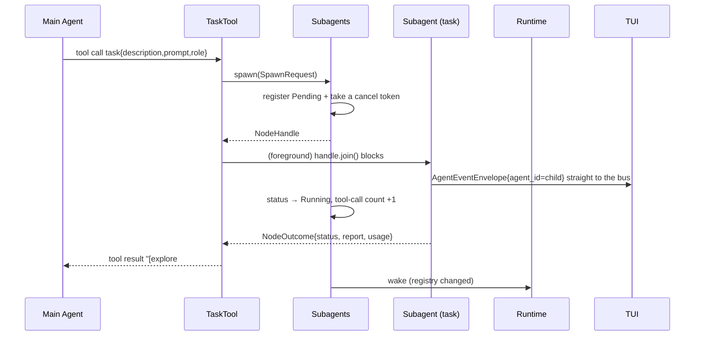

# Subagents and the Loop/Graph Engineering Seams

An app used to maintain a single agent. It now maintains **one main agent (the driver) and any number of subagents**: the driver delegates a self-contained task through the `task` tool, the subagent runs its own turn in its own context, and only its final answer comes back.

This change also serves a second purpose: it places the seams that **Loop engineering** (a replaceable, observable, budgeted loop) and **Graph engineering** (nodes/edges/joins/interrupts) will need next, in the right spots now. The two are sides of one coin — a subagent is the simplest form of "a node" — so they share one vocabulary.

Terminology follows common usage: *loop engineering* treats the loop as a first-class engineering object (strategy, stop conditions, budget, per-iteration observability); *graph engineering* is the orchestration of nodes and edges (shared state, conditional routing, fan-out/fan-in, interrupts, checkpoints).

---

## 1. The Four Settled Tradeoffs

| Tradeoff | Choice | Why |
|----------|--------|-----|
| Persistence | **None** | The session keeps only the `task` call and its result. A subagent's internal conversation dies with the app, as in Claude Code. This skips the whole "tag `Record` with an agent + stable id + rebuild on resume" apparatus. |
| Result delivery | **Foreground blocks + background polls** | `task` blocks by default and returns the subagent's final answer as the tool result; `background=true` returns the name immediately and the driver reads it later with `task_output`. Tool calls inside a `step` are serial, so only background mode gives real parallelism. |
| TUI | **Bar + separate viewer** | Reuse the existing `Transcript` component (scrolling, selection, collapsing, streaming all come free) instead of indenting subagent blocks into the main transcript, which would disturb the row/burst model. |
| Approval | **Restrict tools by role, no prompts** | A subagent's `TurnContext` carries none of the approval, loop-limit, or question channels, so it **cannot structurally** stop and wait for a human. What it may do is decided by its role. |

---

## 2. The Three Root Constraints Before the Change

### C1 · `Agent::run` baked the agent and the loop together

```rust
async fn step(&mut self, sink, ctx) -> Result<Option<String>, _>   // private, the correct half
pub async fn run(&mut self, input, ctx, sink) -> Result<TurnOutput, _>  // loop + cancel + terminal events
```

`step()` was already every primitive loop engineering needs — it was just private and returned only the final text. Loop strategy had nowhere to live because "the seam existed but was hidden".

### C2 · A turn holds `&mut Agent` exclusively, and the park points are singletons

`start_turn` holds `&mut self.agent` through the turn with `tokio::pin!` + `select!`, so nothing can read the agent between steps or checkpoint mid-turn. HITL had only two hardcoded singletons, `pending_approval` / `pending_loop_limit` (question came later).

### C3 · `AppPhase` is primary state, not a derived view

Every `AppPhase` variant carries a unique `turn_id`. Stuffing subagents in too would collide, so the conclusion is **`AppPhase` describes only "user-intent-level" state (the driver's own turn); execution state lives in the registry**.

---

## 3. The Seams That Were Built

| Seam | Change | Who consumes it |
|------|--------|-----------------|
| Loop visible | `Agent::step` is public and returns `Step { text, calls, usage }`; `run` becomes one strategy over it | The subagent runner; future loop strategies |
| Iterations observable | `TurnEvent::StepStarted { index }` / `StepFinished { index, stop }`, `StepStop { ToolUse, FinalAnswer }` | The subagent bar's round counter; future budget/stop conditions |
| Budget belongs to run | `RunPolicy { max_iters }` hangs on `TurnContext`; `Agent` no longer holds `max_iters` | A subagent takes its own `max_iters`; config exposes it to the user |
| Tools can see the run | `Tool::run(&self, args, cx: &TurnContext)` | `task` reads model / mode / turn_id / cancellation from `cx` |
| Tools shareable | `Vec<Arc<dyn Tool>>`, `Agent::with_router(RouterHandle, tools)` | A subagent reuses the same tool instances, so a spawn does not re-connect MCP |
| Router swappable | `Agent::replace_router(Router)` swaps the whole `Arc<Router>` snapshot | See §3.1 |
| Call results structured | `ToolResult::outcome() -> CallOutcome` | A loop strategy can ask "did the last step's tool fail?" without parsing text |
| One step runs its calls in parallel | `step` runs the calls of one response at once; approvals still go one at a time, `ToolCaps::exclusive` tools take turns, and history is written in the order the model requested | See §4.8; this is what makes "dispatch several subagents at once" actually parallel |
| Single event channel | Every agent reports on the same bus | See §4.5 |
| Execution state mirrorable | `AppState.subagents` and `Shared::sync_subagents()`, gated on the registry revision | The TUI bar; `/agents` |

### 3.1 A real bug fixed along the way

`Agent::update_router` used to be:

```rust
let router = Arc::get_mut(&mut guard).expect("router mutated while a snapshot was outstanding");
```

The old invariant was "only call it when no turn holds the agent", but `complete_or_stream` does `let router = self.router();`, which **holds the snapshot across an `await`**. Once a subagent also ran on the same `RouterHandle`, "run `/setup` while a subagent is mid-request" could panic.

It became `replace_router`: swap the whole snapshot. A reader holding the old router finishes its request, and the next reader gets the new one. The cost is that `/setup` changes from "upsert one provider into the live router" to "rebuild the whole router from config" — equivalent on the production path (the router is derived from config anyway), in exchange for a surface with no panic.

---

## 4. Subagent Architecture

### 4.1 Responsibility split

```text
oven-agent: vocabulary       SpawnRequest / NodeHandle / NodeOutcome / NodeInfo /
                             NodeStatus / NodeReport / RoleSpec / SubagentSpawner
oven-app:   machinery        Subagents (registry + semaphore + one tokio task per subagent)
```

Tools only know `Arc<dyn SubagentSpawner>`; they don't know how a subagent is built, which tools it mounts, or how long it runs. This line keeps `task` in `oven-agent` (alongside the other built-in tools) while all policy stays in the app layer.

### 4.2 The path of one `task` call



### 4.3 Lifecycle

```mermaid
stateDiagram-v2
    [*] --> Pending: spawn (awaits a slot; cancellable while queued)
    Pending --> Running: permit acquired, turn_id set
    Pending --> Cancelled: cancelled while queued
    Running --> Completed: turn ended normally
    Running --> Failed: provider / loop error
    Running --> Cancelled: token cancelled
    Completed --> [*]
    Failed --> [*]
    Cancelled --> [*]
```



After a terminal state only **metadata** survives (status, usage, tool-call count, report); the child `Agent` is dropped. The terminal state also stamps `finished_at`, so elapsed time freezes there (`NodeInfo::elapsed_ms`) instead of climbing forever on screen. The registry keeps the last `MAX_FINISHED = 8` finished records; older ones are evicted.

This yields a free benefit: **"node revisit" happens naturally in a graph** — every visit is a fresh `AgentId` + `TurnId`, so no visit concept has to be invented.

### 4.4 Roles and tool sets

| Role | Tool set | Purpose |
|------|----------|---------|
| `explore` | every tool with `permission == Read` | Read-only investigation; the **only** role Plan mode allows |
| `general` | everything except `answer` / `todo_write` / `task` / `task_output` | The default role |

The tool subset is **partitioned by capability**, not listed by hand, so a new read-only tool lands in `explore` automatically. The exclusions are the tools that talk to the user, manage the driver's plan, or would nest delegation.

A subagent's system prompt = the driver's (same instructions / skills / env) + the `subagent.md` preamble (only the final answer comes back; it cannot ask questions; keep it short) + the role guidance.

### 4.5 The event channel: why it must be shared

Before the change the event channel was **built per turn** and drained only inside `start_turn`'s select, so a subagent's events while the main agent was idle had no reader.

Now `AppAgents` holds one `EventBus`, and the driver and every subagent publish straight into it:

```text
AppBuilder ─► tools ─► Subagents::new(…)
             ├─ Main Agent::with_router(router, tools + task + task_output)
             └─ AppAgents { main, subagents, events, wake_rx }

BusSink         wraps each agent's events with its own agent_id/turn_id ─► EventBus ─► frontend
Runtime::run    idle:    select { shutdown, inbox, wake_rx }
start_turn      running: select { shutdown, wake_rx, turn }
```

Events never transit the runtime: a sink emits into the bus while the runtime is busy driving a turn, and neither borrows the other. `wake` is a separate payload-free ping meaning "the registry changed"; the runtime mirrors it into `AppState.subagents` via `Shared::sync_subagents()`, which drops the ping when the registry `revision` is unchanged (a subagent pings on every tool call it starts).

The user-intent park points (approval / loop-limit / question) are no longer inline select arms. `TurnContext` carries an optional `RequestSink` (`has_user()`); a subagent's is `None`, which is what makes it structurally unable to wait on a human.

**One shared channel imposes two rules that must hold** (already in the architecture invariants):

- Only the driver's events may change app state. A subagent's `Usage` is its own, and its `TodosChanged` is not the user's — both still reach subscribers, but neither lands in `AppState`.
- `App::prompt` must filter by `agent_id` first (`env.agent_id == main`), or a subagent's `Completed` would cut a `oven -Q` single-shot query off at half an answer.

### 4.6 Cancellation scope

Each subagent gets one token, linked to two sources (a parked select task in `scoped_token`):

```text
child token ◄── app root token           (app exit = stop everything)
            ◄── the token of its spawn turn (cancel the turn = stop its subagents)
            ◄── /agents stop, or x in the viewer (stop by name)
```

So the only difference between a "foreground" and a "background" subagent is **whether the parent waits for it**, never whether it can outlive the parent. When a subagent ends, its link task is aborted, so links don't pile up with session length. A queued subagent also waits for its permit inside a `select!`, so a cancel releases it instantly instead of leaving it stuck in `queued`.

### 4.7 Addressing and results

| Scenario | Form |
|----------|------|
| Name | `explore#1`, per-role counter, unique within this app run |
| Index | 1-based position in the listing (`/agents 2`) |
| Foreground result | The `task` tool result: `[name done · N steps, M tool calls · K tokens · T s]` + the report, clamped to 16 KB |
| Background result | `task_output {name}` fetches the report; omit `name` to list all |

### 4.8 Running several calls from one step in parallel

When the model puts multiple tool calls in one response it is asking for them to run together — the system prompt tells it to "batch independent calls". The implementation must honor that, or two foreground `task`s would wait on each other, each subagent blocked on the other's signal, and neither would finish.

```text
plan_calls    resolve each call in this response (tool, args, view, call_id)
gate_calls    check permissions one at a time: approvals must be asked one by one (the frontend answers one prompt at a time), in model order
run_calls     start everything allowed at once, emit all Started first, then Finished in true completion order
commit_calls  write history and StepCall in the order the model requested
```

Three fixed constraints:

- **Approvals are serial**: only one `approve/reject` prompt can exist at a time. Throwing N at once would let later ones overwrite the frontend's single `pending_approval`, stranding the earlier answerer and hanging the turn forever.
- **Exclusive tools take turns**: `ToolCaps::exclusive` tools (`file_edit` / `file_write` / `todo_write` / `answer`) run one at a time within a step. The first three are "read—modify—write", so two concurrent edits to one file would clobber each other; `answer` needs the frontend's undivided attention (an overwritten `pending_question` strands the earlier question and the whole turn ends "cancelled"). Everything else — `bash`, readers, MCP, `task`/`task_output` — runs in parallel.
- **History follows request order**: a provider requires each `tool_result` to match its `tool_use` one-to-one and in order, so completion order (the `Finished` events) and commit order (history) are two different things.

The system prompt only promises that batching **independent** calls runs in parallel, so exclusivity lives on the tool's own declaration rather than the model having to guess.

### 4.9 The no-persistence tradeoff

The session holds only the `task` call and its result. After a resume `/agents` is empty, and a subagent's internal conversation (what files it read, which dead ends it took) no longer exists.

This is a deliberate cost: no agent dimension on `Record`, no cross-process stable id to invent for a subagent, and no tree to rebuild on resume that may already have finished running.

---

## 5. The Three TUI Faces

| Face | Content | Entry |
|------|---------|-------|
| Subagent bar | The driver first (`◇ main`, or `◆ main` while its turn runs), then one row each `◆ explore#1 · running 12.0s · 3 tools · label`; active first, done newest-first, subagents capped at 3 rows, overflow as `+N`. The reversed row is the keyboard highlight and starts on the driver. It is the only accented row: a running row is otherwise unstyled, and ◆/◇ marks running or settled. A finished row is dim, a failed one red | While any subagent is still working. After one has been opened or highlighted, the bar stays so Esc can return to the driver, until an Esc that has nothing else to do, or the next message |
| Main transcript | A `task` call is an ordinary tool row; its report is the collapsed body | Always |
| Viewer | That subagent's full transcript, replacing the driver's; the composer line becomes a hint bar | `/agents <n>` / `/agents explore#2`, a click on a bar row, or ↑↓ then Enter while the composer is empty |

The viewer is **created on demand**: a subagent that just spawned, is still queued, or has not said anything yet has no transcript, so opening one builds a fresh transcript seeded with its task label, and later events stream in live. So "open it the moment it's dispatched" works, without waiting for its first event.

The viewer takes the keyboard when open: `↑↓` switches to the previous or next agent in the bar, including the driver. An arrow with a modifier (`Shift+↑`) scrolls the transcript one line. `PgUp` / `PgDn` and the mouse scroll the transcript, `x` stops that subagent, `Ctrl-C` exits as usual, and `Esc` jumps straight back to the driver. This `Esc` is the project's **only single-press one** (`EscAction::acts_immediately`): it loses nothing (the transcript is still there and reopens anytime), whereas an interface that ignored the first `Esc` would read as "stuck"; every other `Esc` still needs the second press to confirm. The hint bar states the exits: `↑↓ switch · esc back · pgup/pgdn scroll · x stop`.

TUI-side state keeps the frames ticking while work continues: `state.agents` is the count of still-working subagents, so subagent timers keep animating, while `state.busy` (the driver's own turn, i.e. `phase.is_active()`) stays false and the composer remains usable.

The single place that routes by `agent_id` is `AppEventKind::Agent(env)`: events whose `env.agent_id` is not the driver's feed only the `Transcript` in `Ui::views` — never the driver's transcript, status, or input. Ids the registry no longer lists get pruned.

`Esc` priority: **pop the queued message → leave the viewer → cancel the driver's turn → rewind**. Hiding a finished bar is what an `Esc` that would otherwise do nothing does, so a rewindable message is not discarded to close the bar.

---

## 6. `/agents` and Config

```text
/agents                          list (index · name · status · steps · tool calls · elapsed — label)
/agents 2  or /agents explore#2  raise a Focus event: a frontend (the TUI) opens the viewer,
                                 with no frontend it does nothing — under headless use /agents to
                                 list and task_output to read reports
/agents stop 2 | /agents stop all
/agents forget 2                 remove from the registry
```

**`/agents` works while a turn is running**, and that is the key to "watch live": if it queued like everything else until the turn ended, the subagent would long be done and there'd be no process to watch.

The approach is not to special-case `/agents`, but to make "does this command need the driver" a fact in the types:

```rust
pub struct CommandContext<'a> {
    agent: Option<&'a mut Agent>,   // a running turn holds it exclusively
    pub subagents: &'a Subagents,   // shared, always available
}

impl<'a> CommandContext<'a> {
    /// A command running with the driver free.
    pub fn with_agent(agent: &'a mut Agent, subagents: &'a Subagents) -> Self;

    /// A command running while a turn holds the driver.
    pub fn shared(subagents: &'a Subagents) -> Self;

    /// The driver, or AppError::AgentBusy when a turn holds it; the runtime reads that as "queue".
    pub fn agent(&mut self) -> Result<&mut Agent, AppError>;
}
```

When a slash command arrives mid-turn, the runtime first tries it with the "no driver" context (`SlashRegistry::run_shared` with `CommandContext::shared`):

- The command never touched `cx.agent()` (`/agents`, `/exit`) → apply immediately;
- The command asked for it (`/clear`, `/setup`, `/plan`, `/model`, `/compact`) → `AgentBusy` → deferred to `pending`, run when the turn ends.

So "which commands take effect mid-turn" is no longer a list to maintain; it is simply whether a command writes `cx.agent()?`. `/compact` deliberately does, because compaction rewrites the history the running turn is still appending to.

The registry is shared state, so a command can act on it directly (stop/remove are the registry's own job); anything that changes app state still comes back as a `CommandOutcome` for the runtime to apply — e.g. `/agents <n>` returns `CommandOutcome::FocusSubagent { id }`, the runtime turns it into `AppEventKind::Subagent(SubagentEvent::Focus { id })`, and the frontend decides what "viewer" means.

```toml
max_iters = 200        # top level: one driver turn's budget

[subagents]
enabled = true         # off unmounts task / task_output
max_concurrent = 4     # spawns past this queue, shown as queued
max_iters = 60         # one subagent's provider round-trip budget
```

---

## 7. Key Types and Files

| Concern | Location |
|---------|----------|
| Delegation protocol (vocabulary) | `crates/oven-agent/src/core/subagent.rs` |
| `task` / `task_output` | `crates/oven-agent/src/capabilities/tools/task.rs` |
| Subagent system-prompt preamble | `crates/oven-agent/src/core/prompt_template/subagent.{rs,md}` |
| Loop seams: `Step` / `RunPolicy` | `crates/oven-agent/src/core/turn.rs`, `crates/oven-agent/src/runtime/agent/step.rs` |
| Iteration events | `crates/oven-agent/src/core/event.rs` (`StepStarted` / `StepFinished` / `StepStop` / `CallOutcome`) |
| Supervisor: registry + semaphore + tasks | `crates/oven-app/src/capabilities/subagent.rs` |
| Role building, tool mounting | `crates/oven-app/src/api/builder.rs` |
| Shared event bus, state mirroring, filtering | `crates/oven-app/src/runtime/mod.rs`, `crates/oven-app/src/runtime/shared.rs` |
| Turn driving | `crates/oven-app/src/runtime/turn.rs` |
| Subagent bar, viewer hint line | `crates/oven-tui/src/widgets/agents.rs` |
| Routing by agent, `Esc` ladder | `crates/oven-tui/src/runtime/ui/mod.rs`, `crates/oven-tui/src/runtime/ui/keys.rs` |
| Commands and context | `crates/oven-app/src/commands/agents.rs`, `crates/oven-app/src/commands/mod.rs` |

---

## 8. Invariants

1. `Running(turn_id)` describes **only the driver's** single active turn. Subagent turns run in parallel and never enter `AppPhase`.
2. The driver's events carry the same `turn_id` as `phase.turn_id()`; subagent events carry their own `agent_id` / `turn_id`.
3. Every turn, whoever's it is, emits exactly one `Started` and one `Completed | Cancelled | Failed`.
4. Only the driver's events change app state (`Usage`, `TodosChanged`).
5. While `Running` / `Cancelling`, the only immediately-effective commands are `Cancel`, `SetMode`, `/model`, `StopSubagent`, `StopSubagents`, the three reply commands, and `Shutdown`; the rest defer to `pending`.
6. A subagent's events must reach the frontend even while the runtime is idle.
7. The calls of one step run in parallel unless `exclusive`; all `Started` fire first, `Finished` in true completion order, but each call's `tool_result` in history must be in the response's `tool_use` order.

---

## 9. Tests

| Layer | Coverage |
|-------|----------|
| `oven-agent` | `task` foreground/background, unknown role, Plan mode rejecting a writing role, failure passthrough, report clamping; the `Step` and step-event sequence; tools reading the current mode/model via `cx`; two mutually-waiting calls both finishing while `exclusive` tools don't overlap; history still in request order |
| `oven-app` | End to end: a scripted main provider returns a `task` call → the subagent runs its own turn → the report returns as the tool result; two foreground `task`s in one response must be running together (the child provider uses a join point, so a serial impl deadlocks); a subagent's usage doesn't pollute the driver's ctx; cancelling a turn also cancels its subagents; with `enabled=false` `task` is an unknown tool; `/agents` applies immediately mid-turn while `/clear` queues |
| `oven-app` | `/agents` list/stop/forget/addressing; command list and descriptions |
| `oven-tui` | Bar ordering and cap, row-to-click mapping, layout band, `Esc` ladder priority |

All are driven by a mock provider and oneshot handshakes; none depends on sleeps.

---

## 10. Deliberately Not Built, and the Interfaces Left Open

**Not now** (building them would be over-engineering): a DAG scheduler, a graph DSL, an on-disk checkpoint format, a parallel tool dispatcher, a node-type system, a replayer. Subagents don't nest (the sub roles have no `task`), so no depth field is needed either.

**Interfaces already open**:

| Future capability | Today's hook |
|-------------------|--------------|
| Swappable loop strategy (ReAct / plan-execute-verify / reflexion / best-of-N) | `Agent::step` + `Step` + `RunPolicy` |
| Iteration budget and stop conditions (token / wall-clock / no-progress) | `RunPolicy` is per-run; `StepStarted`/`StepFinished` are the observation points |
| Graph nodes and edges | `NodeInfo.parent` records the caller; the registry is the node table |
| fan-in / barrier | `NodeHandle::join()` (it split "block" out of "give me an id") |
| Interrupt queue (HITL generalized to many nodes) | Park points are still singleton `Option`s; subagents sidestep this with "no channel", and they should become request-id-indexed queues |
| Checkpoint / replay | `Record` is already the `Serialize + Deserialize` on-disk boundary; `History` holds `Arc<Message>` internally, so a fork is just a refcount |
| Structured edge routing | `ToolResult` is text-only today; a `data: Option<serde_json::Value>` would go on `ToolEvent::Finished` / `ToolResult` — **this is the one change that touches every match arm, so don't pile more onto it now** |

**Bound to be rewritten later**: the `AppPhase` variant set (it can't express a graph's parallel nodes and joins), and the `Runtime::run` / `turn.rs` selects (a graph driver needs to sit beside them; this change already split turn driving out of `runtime/mod.rs` into `runtime/turn.rs` to lower that cost).
